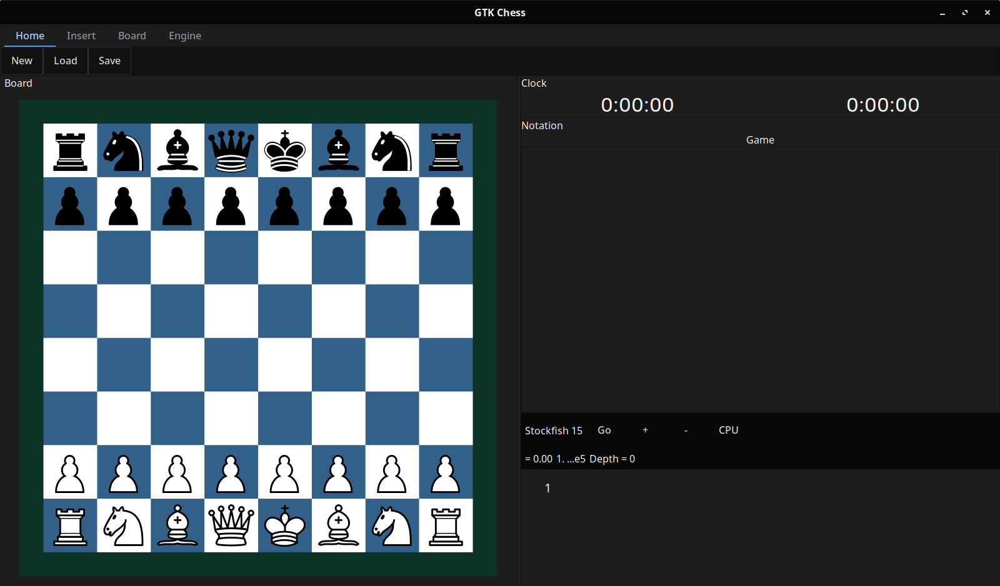

.. GTK-Chess documentation master file, created by
   sphinx-quickstart on Thu Jun 15 13:18:57 2023.
   You can adapt this file completely to your liking, but it should at least
   contain the root `toctree` directive.

Welcome to GTK-Chess documentation!
===================================
**GTK-Chess** is a GUI for UCI chess engines written in C. Follow :ref:`build guide <build_process>`

.. note::
   This project is under active development.

Contents
--------

.. toctree::
   :maxdepth: 3
   :caption: Contents:

   getting started
   overview
   architecture

Indices and tables
==================

* :ref:`genindex`
* :ref:`modindex`
* :ref:`search`
